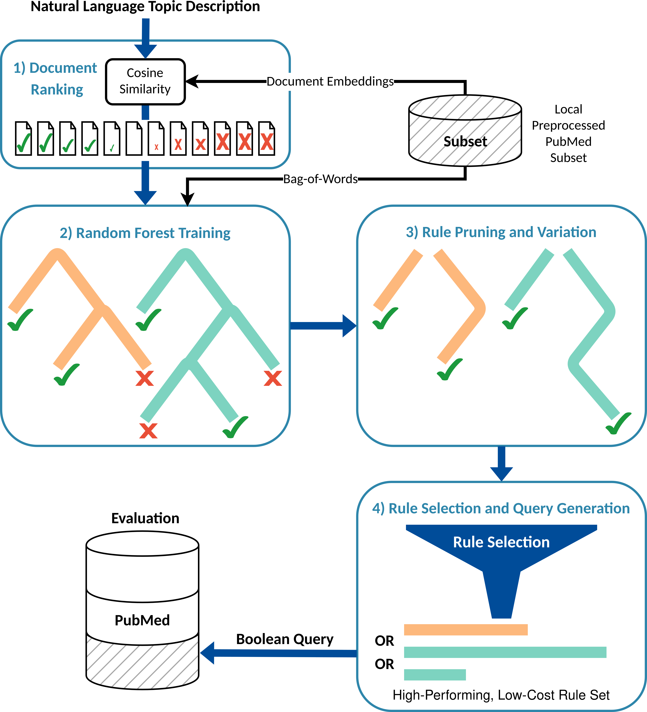

*1. Dense Retrieval:* The pipeline begins by using a dense retrieval model to rank documents from a local corpus by relevance to the query. 
Based on their rank, documents are assigned pseudo-relevance labels and a weight indicating the confidence in that label.

*2. Learning the Tree Ensemble:* A modified Random Forest is trained on the precomputed #gls("bow") representations of the pseudo-labeled documents. 
The goal is to learn a set of decision trees that can effectively separate relevant from non-relevant documents.

*3. Rule Pruning and Variation:* All decision paths leading to a pseudo-relevant classification are extracted as Boolean rules. 
These rules are then rigorously pruned to simplify them, and variations are generated for each to create a diverse pool of candidate rules.

*4. Rule Selection and Query Generation:* Finally, a high-performing, low-cost subset of rules is selected from the candidate pool. 
The selection maximizes retrieval performance on the pseudo-labeled local corpus while penalizing query size and complexity. 
The chosen rules are combined with the #OR operator to form the final Boolean query, which is then evaluated on #pubmed.

# Documentation
Scripts are written for the Slurm system of the HPC at TU Dresden (https://compendium.hpc.tu-dresden.de/). 
If you are not working on a similar system, some of the module load commands will need to be replaced with the corresponding installation commands.
All Python scripts must be executed as modules (-m) from the repository root, as done in the scripts.
However, most scripts are run from the folder that contains the repositories.

## Setup
```bash
git clone git@github.com:FloFmm/boolean-query-generation.git
boolean-query-generation/scripts/csmed/setup_csmed.sh
```

## Install Spacy Model (Required for Text BoW)
```bash
cd systematic-review-datasets/data/spacy
wget https://github.com/explosion/spacy-models/releases/download/en_core_web_lg-3.7.1/en_core_web_lg-3.7.1.tar.gz
tar -xzf en_core_web_lg-3.7.1.tar.gz
```

## Bag-of-Words Creation
```bash
boolean-query-generation/scripts/csmed/bag_of_words.sh
```

## Document Ranking
```bash
boolean-query-generation/scripts/csmed/retrieval.sh
```

## Parameter Tuning
```bash
boolean-query-generation/scripts/parameter_tuning/optuna.sh
```

## Evaluation (requires ranked documents for each review topic)
```bash
boolean-query-generation/scripts/evaluation/eval_best.sh
```

## Statistics and Visualization
```bash
scripts/visualization/vis_all_local.sh
```

## Full Example
```bash
boolean-query-generation/scripts/full_example_rf.sh
```

